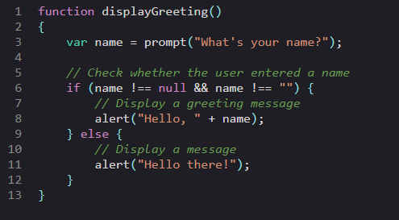

# SimpleSyntaxJs (v1.0.5)
A simple lightweight but powerful syntax highlighting library for textareas

**SimpleSyntaxJs textarea appearance example:**



### Installation

You can install SimpleSyntax-JS via npm:
```
npm install simplesyntax-js
```

Or use CDN inside html:
```
<link href="https://cdn.jsdelivr.net/npm/simplesyntax-js@latest/dist/simplesyntax.min.css" rel="stylesheet">
<script src="https://cdn.jsdelivr.net/npm/simplesyntax-js@latest/dist/simplesyntax.min.js"></script>
```

Or you can download the library and include it directly in your HTML:
```
<link href="path/to/simplesyntax.min.css" rel="stylesheet">
<script src="path/to/simplesyntax.min.js"></script>
```

If you installed via npm, this is how to import the library:
```
import simpleSyntax from 'simplesyntax-js';
import 'simplesyntax-js/dist/simplesyntax.min.css';
```

### Initializing SimpleSyntaxJs: 

In HTML, write a textarea tag wrapped in a div tag, if you want the textarea to not take a whole block, you can for example, set the div's display to inline-block.
```
<div>
  <textarea id="textarea-id"></textarea>
</div>
```
in Javascript code, simply call the SimpleSyntax() function on a textarea to apply syntax highlighting to it.
```
const textarea = document.getElementById("textarea-id");
textarea.simpleSyntax();
```
to set the width and height of the textarea in pixels, just set it normally with css before initializing simpleSyntax, for example:
```
textarea { width: 600px; height: 400px; }
```

### Configuration Options

**copyButton** : Add a copy button to the top right of the textarea. Default is false.

**findAndReplace** : Enable find and replace functionality. Default is false.

**font** : The font family to use for the code snippet. Default is 'monospace'.

**language** : The programming language of the textarea. Default is 'none'.

**lineNumbers** : Enable line numbers display. Default is false.

**matchBraces** : Enable matching braces highlighting. Default is false.

**readOnly** : Set the textarea as read-only. Default is false.

**tabChars** : The chars to type when pressing tab key. Default is '\t'.

**theme** : The theme for syntax highlighting. Default is 'light'.
currently available theme choices: light, dark, nord, solarized-light, solarized-dark
but you can create a custom css theme and use it if you want!

**width** : Set the width of the textarea, use this in case the textarea has a percentage width.

### Example with Configuration options:

```
textarea.simpleSyntax({
    language: 'javascript',
    theme: 'dark',
    lineNumbers: true,
    width: '100%',
    matchBraces: true,
    findAndReplace: true,
    tabChars: '\t'
});
```

### Functions:

To zoom in:
```
textarea.zoomIn();
```
To zoom out:
```
textarea.zoomOut();
```
To show Find toolbar: (you should first set findAndReplace to true when initializing)
```
textarea.showFind();
```
To show Replace toolbar: (you should first set findAndReplace to true when initializing)
```
textarea.showReplace();
```
To set the theme of the textarea after initializing:
```
textarea.setTheme(theme);
```
To insert text programatically into the textarea, and if focused, insert text at caret position:
```
textarea.insertText(textToInsert);
```
To insert html tag programatically into the textarea, and if part of textarea is selected, wrap it with the tag:
```
textarea.insertHtmlTag(htmlTagName);
```
To change the value of the textarea programatically:
```
textarea.value = newValue;
textarea.textChanged(); // Important: you must call this after changing the textarea's value programatically
```

## License

SimpleSyntaxJs is licensed under the MIT License. See the LICENSE file for details.

Note: If you encounter any issues or have any feedback, please don't hesitate to open an issue. I'd love to hear from you!
Feel free to submit reviews, bug reports, or feature requests!
